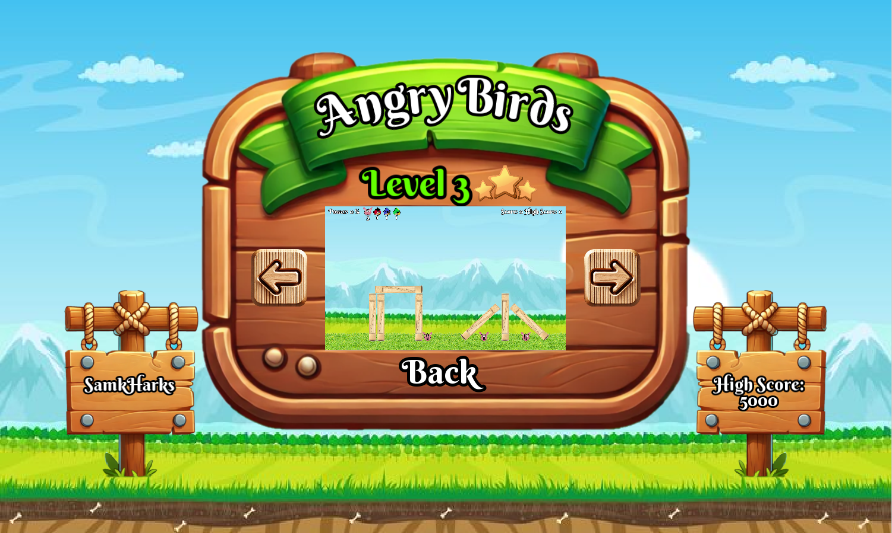
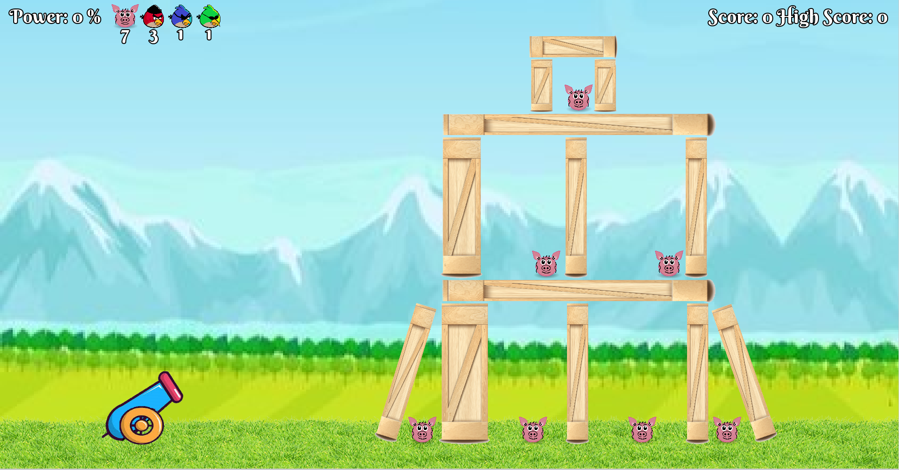

# Angry Birds Game

Welcome to my **Angry Birds Game**, a physics-based 2D game inspired by the original Angry Birds. This game is built using **SFML** (Simple and Fast Multimedia Library) for rendering and input handling, and **Box2D** for realistic physics simulation. Launch birds with a cannon to destroy structures and defeat the pigs!



## Features
- **2D Physics Simulation** powered by **Box2D**
- **Graphics Rendering** and **Input Handling** with **SFML**
- **JSON (nlohmann/json)** for data formatting when storing and reading data
- **Resource management** - Custom singleton ResourceManager class. This class centralizes the loading, storage, and management of all game assets, such as textures, fonts, and sound effects. It ensures that resources are loaded once and cached for reuse, preventing redundant loading and reducing memory usage. The ResourceManager controls the entire lifecycle of these resources, from loading to clean-up, ensuring resources remain available throughout the game's runtime and are properly destroyed after the game closes. Other classes simply access these resources via references, which enhances performance and keeps resource management consistent across the game.
- **Level editor** - Custom level editor with a user-friendly UI, featuring built-in **collision detection** to prevent overlapping objects, ensuring that levels are both playable and well-structured. The editor automatically generates a **preview screenshot** for the level, which is used in the level selection menu. Levels are saved in **JSON format**, seamlessly integrating into the game. The editor adds new levels directly to the game’s level selection menu without requiring any manual file modifications. This automation minimizes errors and significantly speeds up the level creation process, enabling rapid development of custom levels.
- **Main menu** 
- **Pause (menu)** - Pause game or level editor, exit to main menu or exit game
- **Settings (menu)** - WIP (currently only back button)
- **Level selector (menu)** - Choose level for current user and see how many stars user has achieved for each level
- **User selector (menu)** - Create new users & load existing users
- **Level end menu** - Shows achieved stars, go to next level, go to main menu or exit
- **Three birds with different powers:**
    - **Red Bird:** When its power is activated, the Red Bird adds a strong downward impulse, drastically increasing its velocity towards the ground. This allows the bird to crash into objects with great force, making it highly effective against targets below it.
    - **Green Bird:** The Green Bird's power gives the player full control over its movement for a limited time. Using the keyboard, the player can manually fly the bird toward objects, allowing for precision targeting and destruction.
    - **Blue Bird:** Upon activation, the Blue Bird splits into three smaller "MiniBird" projectiles, which fly in different directions. This spread attack is useful for covering a wider area and hitting multiple targets at once.
- **Multiple levels with destructible environments** - Currently 3 levels
- **High score** - WIP (save high scores for each user and view user's high score for each level, menu for displaying all high scores missing)
- **Sound effects and background music** - WIP (currently menu has bg music and cannon has launch sound) 
- **Cross-platform support for Windows, Linux, and macOS**
#### Level Editor example - saving fails

## Prerequisites

To build and run the game, ensure the following dependencies are installed:

- **CMake** (minimum version 3.16)
- A **C++17** compatible compiler (GCC, Clang, MSVC, etc.)

### Install Dependencies on Linux (Ubuntu Example)
For Ubuntu and other Debian-based systems, install SFML dependencies using:
```bash
sudo apt update
sudo apt install libxrandr-dev libxcursor-dev libudev-dev \
                 libfreetype-dev libopenal-dev libflac-dev \
                 libvorbis-dev libgl1-mesa-dev libegl1-mesa-dev
```

### Install Dependencies on Windows
- **CMake**: Download and install from [CMake official site](https://cmake.org/download/).
- **SFML** and **Box2D**: These are automatically fetched during the build process using CMake’s FetchContent.

## Build Instructions

1. **Clone the repository:**
   ```bash
   git clone <repository_url>
   cd angry-birds
   ```

2. **Configure and Build the Project:**
   ```bash
   cmake -B build
   cmake --build build
   ```

3. **Run the Game:**
   After building, you can run the game executable:
   ```bash
   ./build/bin/AngryBirds
   ```
   On Windows, the executable can be found in `build/bin/AngryBirds.exe`.

**OR Building with Visual Studio Code:** If you prefer using **VSCode**, you can take advantage of the **CMake Tools** extension:
- Open the project folder in VSCode.
- The extension will automatically detect the CMakeLists.txt file.
- Use the VSCode commands to configure (CMake: Configure), build (CMake: Build), and run (CMake: Run Without Debugging) the project directly within the editor.

### Notes for Windows Users:
- The build process automatically copies the necessary **OpenAL32.dll** to the output directory, ensuring audio support for SFML.


## How to Play

1. **Aim the Cannon:** Use the mouse to control the angle of the cannon. Hold down the left mouse button to adjust the power of the bird launch.
2. **Launch the Bird:** Release the left mouse button to fire the bird at the target structures.
3. **Activate Bird Powers:** After launching, press the right mouse button to activate the bird's special power (each bird has a unique power—see the "Three Birds with Different Powers" section for details).
4. **Complete the Level:** Destroy all the pigs on each level to progress to the next one.

## Project Structure and MVC Pattern
This project follows the **Model-View-Controller (MVC)** architectural pattern, which helps organize the code by separating concerns:
- **Model**: Represents the game state, data and logic, including physics, levels, bird properties, and object states.
- **View**: Handles the rendering and user interface using SFML, ensuring the game world and menus are displayed to the player.
- **Controller**: Manages user input, such as aiming the cannon, firing birds, and interacting with the UI, while coordinating the Model and View.

The main directories are:
- **src/**: Contains all the C++ source files.
- **assets/**: Stores the game's resources, including textures, sounds, and level data.
- **CMakeLists.txt**: The build configuration file using CMake.
- **build/**: Directory where compiled binaries are generated.

## SFML and Box2D Integration

- **SFML** is used for rendering, input handling, and window management.
- **Box2D** handles all the game physics, including bird movement, collision detection, and the destruction of structures..

## Cross-Platform Support

This project should support Windows, macOS, and Linux. CMake automatically configures and builds the project on all these platforms.

### Build Options
You can configure whether to build shared or static libraries by toggling the following option in `CMakeLists.txt`:
```cmake
option(BUILD_SHARED_LIBS "Build shared libraries" OFF)
```
Currently, static libraries are being used for both SFML and Box2D.

---

### Additional Resources
- [SFML Documentation](https://www.sfml-dev.org/documentation/2.6.1/)
- [Box2D Documentation](https://box2d.org/documentation/) (Note documentation is for version 3.x.x)
- [CMake Documentation](https://cmake.org/documentation/)

---
